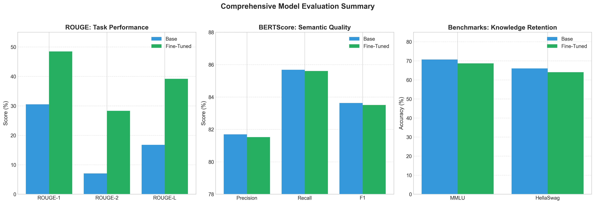
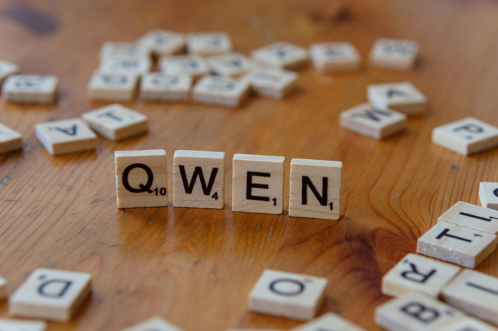
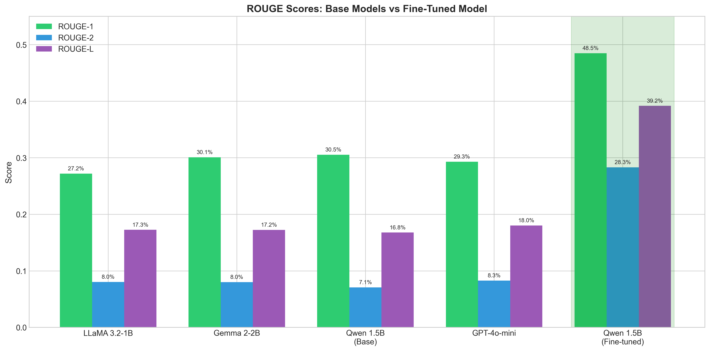
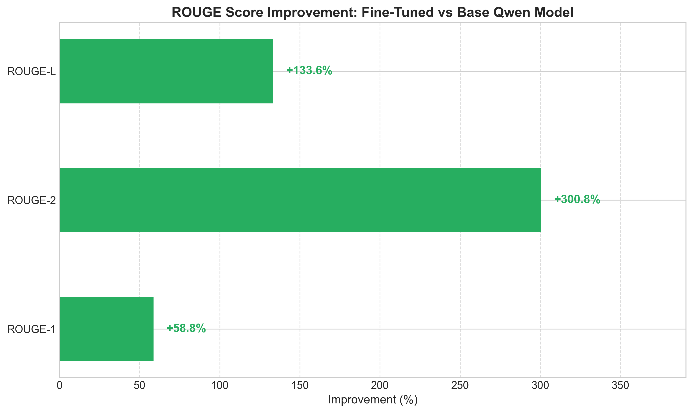
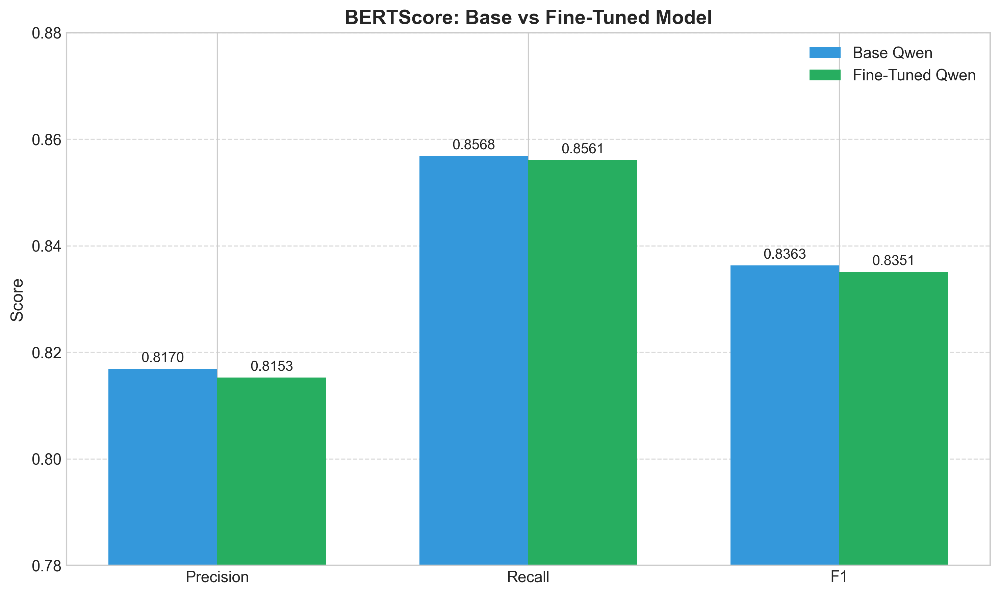
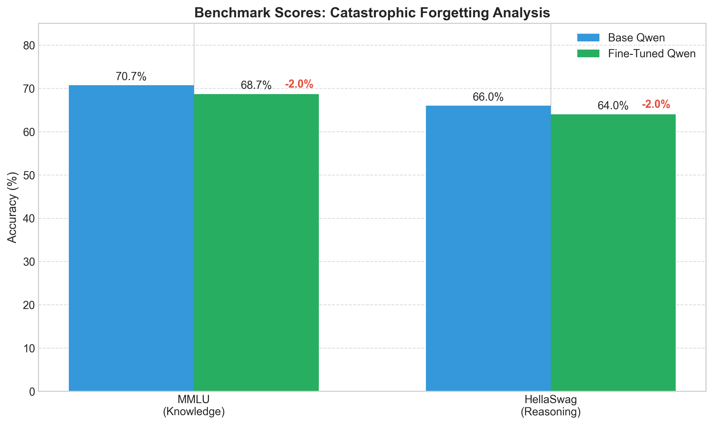

<div align="center">

#  Qwen-QLoRA-Chef

**Fine-tuning Qwen2.5-1.5B for Recipe Generation using QLoRA**

[](https://www.python.org/downloads/)
[](https://creativecommons.org/licenses/by-nc-sa/4.0/)
[](https://huggingface.co/Daniel-Krasik/Qwen2.5-1.5B-QLoRA-Recipe)
[](https://www.runpod.io/)

*A complete pipeline for domain-adapting language models to generate cooking recipes with dramatic improvements in task performance while preserving general capabilities.*



</div>

---

##  Highlights

| Metric | Improvement |
|--------|-------------|
|  **ROUGE-1** | **+59%** over base model |
|  **ROUGE-2** | **+299%** (phrase-level matching) |
|  **ROUGE-L** | **+134%** (longest common subsequence) |
|  **Knowledge Retention** | **97%** general capabilities preserved |
|  **Training Efficiency** | Only **0.5%** parameters trained |
|  **Infrastructure** | Multi-GPU DDP support on RunPod |

---

##  Table of Contents

- [Project Overview](#-project-overview)
- [The Complete Pipeline](#-the-complete-pipeline)
  - [Phase 1: Dataset Analysis](#phase-1-dataset-analysis)
  - [Phase 2: Base Model Evaluation](#phase-2-base-model-evaluation)
  - [Phase 3: Model Selection](#phase-3-why-qwen-was-selected)
  - [Phase 4: QLoRA Fine-tuning](#phase-4-qlora-fine-tuning)
  - [Phase 5: Evaluation Framework](#phase-5-comprehensive-evaluation)
- [Results & Analysis](#-results--analysis)
- [Installation](#-installation)
- [Usage](#-usage)
- [Project Structure](#-project-structure)
- [Configuration Guide](#-configuration-guide)
- [Notebooks](#-notebooks)
- [Technical Details](#-technical-details)
- [Model Weights](#-model-weights)
- [Citation](#-citation)
- [License](#-license)
- [Acknowledgments](#-acknowledgments)

---

## 🎯 Project Overview

### The Research Question

> *Can I efficiently fine-tune a compact language model to excel at domain-specific text generation (recipe creation) while minimizing catastrophic forgetting of general language understanding capabilities?*

### So Why Recipe Generation?

Recipe generation presents a unique challenge for language models:

1. **Structured Output**: Recipes require specific formatting with ingredients, quantities, and sequential instructions
2. **Domain Knowledge**: Culinary terminology, cooking techniques, and ingredient combinations
3. **Practical Evaluation**: Clear metrics for success (ROUGE for format, BERTScore for semantics)
4. **Real-World Application**: Directly applicable to cooking assistants and recipe recommendation systems

### My Project Goals

This project implements a complete ML pipeline that:

-  **Evaluates** multiple base models (LLaMA, Gemma, Qwen, GPT-4o-mini) on recipe generation
-  **Selects** the optimal base model through systematic benchmarking
-  **Fine-tunes** using QLoRA for memory-efficient adaptation
-  **Validates** improvements across multiple metrics (ROUGE, BERTScore, MMLU, HellaSwag)
-  **Deploys** trained models to Hugging Face Hub for easy access

---

##  The Complete Pipeline

<div align="center">

</div>

### Phase 1: Dataset Analysis

I utilized the **[recipe-nlg-llama2](https://huggingface.co/datasets/skadewdl3/recipe-nlg-llama2)** dataset from Hugging Face, which contains approximately **2 million recipes** with rich structured data.

#### Dataset Structure

| Field | Description | Example |
|-------|-------------|---------|
| `title` | Recipe name | "Honey Garlic Chicken" |
| `NER` | Named Entity Recognition (ingredients) | "chicken, garlic, honey, soy sauce" |
| `ingredients` | Full ingredient list with quantities | "2 lbs chicken thighs, 4 cloves garlic..." |
| `directions` | Step-by-step cooking instructions | "1. Preheat oven to 375°F..." |

#### Data Splits

```
┌─────────────────────────────────────────────────────┐
│  Training Set    │  ~2,000,000 recipes (full dataset) │
│  Validation Set  │  200 samples                       │
│  Test Set        │  200 samples                       │
└─────────────────────────────────────────────────────┘
```

The validation and test sets were carefully sampled to ensure representative evaluation while keeping inference costs manageable.

---

### Phase 2: Base Model Evaluation

Before fine-tuning, I conducted a systematic evaluation of multiple open-source and commercial language models to establish baselines and select the optimal candidate for fine-tuning.

#### Models Evaluated

| Model | Parameters | Type | System Message Support |
|-------|------------|------|------------------------|
| **LLaMA 3.2-1B-Instruct** | 1B | Open-source |  Yes |
| **Gemma 2-2B-IT** | 2B | Open-source |  No |
| **Qwen 2.5-1.5B-Instruct** | 1.5B | Open-source |  Yes |
| **GPT-4o-mini** | Unknown | Commercial API |  Yes |

#### Baseline ROUGE Results

| Model | ROUGE-1 | ROUGE-2 | ROUGE-L |
|-------|---------|---------|---------|
| LLaMA 3.2-1B-Instruct | 27.2% | 8.0% | 17.3% |
| Gemma 2-2B-IT | 30.1% | 8.0% | 17.2% |
| **Qwen 2.5-1.5B-Instruct** | **30.5%** | 7.1% | 16.8% |
| GPT-4o-mini | 29.3% | 8.3% | 18.0% |

<div align="center">

</div>

---

### Phase 3: Why Qwen Was Selected

After comprehensive evaluation, **Qwen 2.5-1.5B-Instruct** was selected as the base model for fine-tuning based on:

#### Selection Criteria

| Criterion | Qwen 2.5-1.5B | Reasoning |
|-----------|---------------|-----------|
| **ROUGE-1 Performance** |  Highest (30.5%) | Best unigram overlap with reference recipes |
| **Model Size** |  1.5B parameters | Optimal balance of capability and efficiency |
| **System Message Support** |  Native support | Essential for instruction-following format |
| **Quantization Compatibility** |  Excellent | Works seamlessly with 4-bit QLoRA |
| **Open-Source License** |  Apache 2.0 | Permissive for research and commercial use |
| **Community Support** |  Active | Regular updates from Qwen team |

#### Why Not Others?

- **LLaMA 3.2-1B**: Lower baseline performance, smaller parameter count
- **Gemma 2-2B**: No native system message support complicates instruction formatting
- **GPT-4o-mini**: Commercial API, not suitable for fine-tuning, higher cost

---

### Phase 4: QLoRA Fine-tuning

#### What is QLoRA?

**QLoRA (Quantized Low-Rank Adaptation)** combines two powerful techniques:

1. **4-bit Quantization**: Reduces model memory footprint by ~75%
2. **LoRA (Low-Rank Adaptation)**: Trains only small adapter matrices instead of full weights

```
┌────────────────────────────────────────────────────────────┐
│                    QLoRA Architecture                       │
├────────────────────────────────────────────────────────────┤
│  Base Model (Frozen)     →  4-bit Quantized (NF4)          │
│  LoRA Adapters (Trained) →  ~0.5% of total parameters      │
│  Memory Savings          →  Train 1.5B model on 16GB GPU   │
└────────────────────────────────────────────────────────────┘
```

#### Training Configuration

```yaml
# QLoRA Settings
load_in_4bit: true
bnb_4bit_quant_type: nf4
bnb_4bit_use_double_quant: true
bnb_4bit_compute_dtype: bfloat16

# LoRA Configuration
lora_r: 16                    # Rank of adaptation matrices
lora_alpha: 32                # Scaling factor
lora_dropout: 0.1             # Regularization
target_modules: ["q_proj", "v_proj"]  # Attention projections

# Training Hyperparameters
num_epochs: 1
max_steps: 300
learning_rate: 2e-4
batch_size: 4
gradient_accumulation_steps: 4
sequence_len: 512
lr_scheduler: cosine
warmup_steps: 50
optimizer: paged_adamw_8bit
```

#### Training Infrastructure (RunPod)

Training was conducted on **RunPod** cloud GPU infrastructure:

| Specification | Value |
|---------------|-------|
| **GPU** | NVIDIA A100 (40GB) / RTX 4090 (24GB) |
| **Training Time** | ~1 hour for 300 steps |
| **Memory Usage** | ~12GB with 4-bit quantization |
| **Multi-GPU** | Supported via DDP (1-8 GPUs) |

#### Assistant-Only Masking

A key tactic in the training approach is **assistant-only masking**:

```python
# Only compute loss on assistant (generated) tokens
labels = [-100] * prompt_length + tokens["input_ids"][prompt_length:]
```

This ensures the model learns to generate recipes without being penalized for the instruction format, resulting in more focused training. I do this to focus on the response of the model rather the whole input and output

---

### Phase 5: Comprehensive Evaluation

Our evaluation framework assesses three critical dimensions:

```
┌─────────────────────────────────────────────────────────────────┐
│                    Evaluation Framework                          │
├─────────────────────────────────────────────────────────────────┤
│  1. ROUGE Metrics      → Task performance (lexical overlap)     │
│  2. BERTScore          → Semantic quality (contextual similarity)│
│  3. MMLU & HellaSwag   → General capabilities (forgetting check)│
└─────────────────────────────────────────────────────────────────┘
```

#### Why Multiple Metrics?

- **ROUGE** alone can be gamed by memorizing exact phrases
- **BERTScore** captures semantic meaning beyond exact matches
- **Benchmarks** ensure we haven't sacrificed general language understanding

---

##  Results & Analysis

### Task Performance: ROUGE Scores

| Model | ROUGE-1 | ROUGE-2 | ROUGE-L |
|-------|---------|---------|---------|
| LLaMA 3.2-1B-Instruct | 27.2% | 8.0% | 17.3% |
| Gemma 2-2B-IT | 30.1% | 8.0% | 17.2% |
| Qwen 2.5-1.5B (Base) | 30.5% | 7.1% | 16.8% |
| GPT-4o-mini | 29.3% | 8.3% | 18.0% |
| **Qwen 2.5-1.5B (Fine-tuned)** | **48.5%** | **28.3%** | **39.2%** |

#### Improvement Analysis

| Metric | Base → Fine-tuned | Absolute Gain | Relative Improvement |
|--------|-------------------|---------------|----------------------|
| ROUGE-1 | 30.5% → 48.5% | +18.0 pts | **+59%** |
| ROUGE-2 | 7.1% → 28.3% | +21.2 pts | **+299%** |
| ROUGE-L | 16.8% → 39.2% | +22.4 pts | **+134%** |

<div align="center">

</div>

> **Key Insight**: The dramatic +299% improvement in ROUGE-2 indicates the model learned domain-specific phrase patterns (bigrams) like "preheat oven", "mix ingredients", "let cool".

---

### Semantic Quality: BERTScore

| Model | Precision | Recall | F1 Score |
|-------|-----------|--------|----------|
| Qwen 2.5-1.5B (Base) | 0.817 | 0.857 | 0.836 |
| Qwen 2.5-1.5B (Fine-tuned) | 0.815 | 0.856 | 0.835 |
| **Difference** | -0.002 | -0.001 | **-0.001** |

<div align="center">

</div>

> **Key Insight**: BERTScores remain virtually identical (< 0.2% change), confirming that fine-tuning improved **format adherence** and **domain terminology** without degrading **semantic quality**.

---

### Knowledge Retention: Catastrophic Forgetting Analysis

| Benchmark | Base Model | Fine-Tuned | Change | Retention |
|-----------|------------|------------|--------|-----------|
| **MMLU** | 70.7% | 68.7% | -2.0% | 97.2% |
| **HellaSwag** | 66.0% | 64.0% | -2.0% | 97.0% |

<div align="center">

</div>

> **Key Insight**: With only **2% degradation** on general benchmarks, QLoRA successfully preserved the model's broad language understanding while specializing it for recipe generation. This demonstrates the effectiveness of Low-Rank Adaptation for domain-specific fine-tuning.

---

### Summary: The Trade-off

```
┌─────────────────────────────────────────────────────────────────┐
│                      Results Summary                             │
├─────────────────────────────────────────────────────────────────┤
│   ROUGE-1:    +59% improvement (task performance)             │
│   ROUGE-2:    +299% improvement (phrase-level matching)       │
│   ROUGE-L:    +134% improvement (sequence matching)           │
│   BERTScore:  Maintained (semantic quality preserved)         │
│   MMLU:       -2% (minimal knowledge loss)                    │
│   HellaSwag:  -2% (minimal reasoning loss)                    │
├─────────────────────────────────────────────────────────────────┤
│   NET RESULT: Massive task gains with negligible trade-offs   │
└─────────────────────────────────────────────────────────────────┘
```

---

##  Installation

### Prerequisites

- **Python**: 3.10 or higher
- **CUDA**: 11.8+ (for GPU training)
- **GPU Memory**: 16GB+ recommended - mainly using runpod
- **OS**: Linux, Windows, macOS

### Local Setup

```bash
# Clone the repository
git clone https://github.com/Daniel-Krasik/Qwen-QLoRA-Chef.git
cd Qwen-QLoRA-Chef

# Create virtual environment
python -m venv venv
source venv/bin/activate  # Linux/macOS
# OR
venv\Scripts\activate     # Windows

# Install PyTorch with CUDA support
pip install torch==2.7.1 --index-url https://download.pytorch.org/whl/cu118

# Install dependencies
pip install -r requirements.txt
```

### RunPod Setup

For cloud training on RunPod:

```bash
# On your RunPod instance
git clone https://github.com/Daniel-Krasik/Qwen-QLoRA-Chef.git
cd Qwen-QLoRA-Chef

# Install RunPod-specific dependencies
pip install -r runpod_requirements.txt
```

### Environment Variables

Create a `.env` file in the project root:

```env
# Hugging Face (required for model upload)
HF_USERNAME=your_huggingface_username
HF_TOKEN=your_huggingface_token

# Weights & Biases (required for experiment tracking)
WANDB_API_KEY=your_wandb_api_key

# OpenAI (optional: for GPT-4o-mini baseline comparison)
OPENAI_API_KEY=your_openai_api_key
```

---

##  Usage

### Quick Inference

```python
from peft import PeftModel
from transformers import AutoModelForCausalLM, AutoTokenizer

# Load the fine-tuned model
base_model = "Qwen/Qwen2.5-1.5B-Instruct"
adapter_id = "Daniel-Krasik/Qwen2.5-1.5B-QLoRA-Recipe"

tokenizer = AutoTokenizer.from_pretrained(base_model)
model = AutoModelForCausalLM.from_pretrained(base_model, device_map="auto")
model = PeftModel.from_pretrained(model, adapter_id)

# Generate a recipe
messages = [
    {
        "role": "system", 
        "content": "You will generate one cooking recipe. List all necessary ingredients and give detailed steps."
    },
    {
        "role": "user", 
        "content": "Include ingredients: chicken, garlic, lemon, rosemary, olive oil"
    }
]

prompt = tokenizer.apply_chat_template(messages, tokenize=False, add_generation_prompt=True)
inputs = tokenizer(prompt, return_tensors="pt").to(model.device)
outputs = model.generate(**inputs, max_new_tokens=500, do_sample=False)

print(tokenizer.decode(outputs[0], skip_special_tokens=True))
```

### Training

#### Single-GPU Training

```bash
cd code
python train_qlora.py
```

#### Multi-GPU Training (DDP)

```bash
cd code
accelerate launch --config_file configs/accelerate/ddp_4gpu.yaml train_qlora_ddp.py
```

### Evaluation

#### ROUGE Evaluation

```bash
cd code
python evaluate_qlora_Rouge.py
```

#### BERTScore Evaluation

```bash
cd code
python evaluate_qlora_BERT.py
```

#### Benchmark Evaluation (MMLU, HellaSwag)

```bash
cd code/evaluate_benchmarks
python run_eval_suite.py --model_path Daniel-Krasik/Qwen2.5-1.5B-QLoRA-Recipe --model_type full
```

---

##  Project Structure

```
Qwen-QLoRA-Chef/
│
├── 📂 code/                           # Source code
│   ├── train_qlora.py                 # Single-GPU QLoRA training
│   ├── train_qlora_ddp.py             # Multi-GPU DDP training
│   ├── evaluate_qlora_Rouge.py        # ROUGE evaluation script
│   ├── evaluate_qlora_BERT.py         # BERTScore evaluation script
│   ├── evaluate_qlora_Rouge_ddp.py    # Distributed ROUGE evaluation
│   ├── config.yaml                    # Main configuration file
│   ├── paths.py                       # Centralized path definitions
│   │
│   ├── 📂 utils/                      # Utility modules
│   │   ├── __init__.py
│   │   ├── config_utils.py            # Configuration loading
│   │   ├── data_utils.py              # Dataset preprocessing
│   │   ├── model_utils.py             # Model setup (quantization, LoRA)
│   │   └── inference_utils.py         # Prediction generation, metrics
│   │
│   ├── 📂 evaluate_benchmarks/        # MMLU/HellaSwag evaluation
│   │   ├── benchmark_eval.py
│   │   ├── run_eval_suite.py
│   │   └── eval_config.yaml
│   │
│   ├── 📂 evaluate_GPT-4o-mini/       # OpenAI baseline evaluation
│   │   ├── __init__.py
│   │   └── evaluate_GPT-4o-mini.py
│   │
│   └── 📂 configs/accelerate/         # Accelerate configurations
│       └── ddp_4gpu.yaml
│
├── 📂 notebooks/                       # Jupyter notebooks
│   ├── Data_Preprocessing.ipynb       # Dataset exploration
│   ├── Evaluate_Baseline_Models_Rouge.ipynb
│   ├── Model_Evaluation_Comparison.ipynb
│   ├── master_config.yaml
│   └── 📂 BERT_notebooks/
│       ├── evaluate_baseline_model_BERT.ipynb
│       └── evaluate_finetuned_BERT.ipynb
│
├── 📂 Rouge_Scores/                    # ROUGE evaluation results
│   ├── 📂 Base_Model_Rouge_Results/
│   │   ├── eval_results_qwen.json
│   │   ├── eval_results_gemma.json
│   │   ├── eval_results_GPT-4o-mini.json
│   │   └── Llama-3.2-1B-Instruct_eval_results.json
│   └── 📂 Fine_Tune_Rouge_Results/
│       └── eval_results_FineTuned.json
│
├── 📂 BERT_Scores/                     # BERTScore results
│   ├── 📂 Base_Model_BERT_Results/
│   └── 📂 Fine_Tune_BERT_Results/
│
├── 📂 Benchmark_Scores/                # MMLU/HellaSwag results
│   ├── eval_benchmarks_base_model.json
│   └── eval_benchmarks_finetuned_model.json
│
├── 📂 Images_Publication/              # Generated visualizations
│   ├── benchmark_comparison.png
│   ├── bert_comparison.png
│   ├── comprehensive_comparison.png
│   ├── rouge_comparison_all_models.png
│   └── rouge_improvement.png
│
├── 📂 lora/                            # LoRA checkpoint files
│   ├── 📂 checkpoint-200/
│   └── 📂 checkpoint-300/
│
├── requirements.txt                    # Local dependencies
├── runpod_requirements.txt             # RunPod dependencies
├── README.md                           # This file
├── Repository_Guide.md                 # Best practices guide
└── Rubrics_publication.md              # Evaluation rubrics
```

---

##  Configuration Guide

### Main Configuration (`code/config.yaml`)

```yaml
# ==============================================
# Model Configuration
# ==============================================
base_model: Qwen/Qwen2.5-1.5B-Instruct  # Base model from HuggingFace

# ==============================================
# Dataset Configuration
# ==============================================
dataset:
  name: skadewdl3/recipe-nlg-llama2     # Dataset identifier
  cache_dir: ../data/datasets            # Local cache directory
  field_map:
    input: NER                           # Ingredients (Named Entity Recognition)
    output: directions                   # Recipe directions
    title: title                         # Recipe title
    ingredients: ingredients             # Full ingredient list
  splits:
    train: all                           # Use full training set
    validation: 200                      # Validation samples
    test: 200                            # Test samples

# ==============================================
# QLoRA Configuration
# ==============================================
load_in_4bit: true                       # Enable 4-bit quantization
bnb_4bit_quant_type: nf4                 # NormalFloat4 quantization
bnb_4bit_use_double_quant: true          # Double quantization for memory
bnb_4bit_compute_dtype: bfloat16         # Compute dtype

# LoRA Settings
lora_r: 16                               # LoRA rank
lora_alpha: 32                           # LoRA alpha (scaling)
lora_dropout: 0.1                        # Dropout for regularization
target_modules: ["q_proj", "v_proj"]     # Target attention modules

# ==============================================
# Training Configuration
# ==============================================
num_epochs: 1                            # Number of epochs
max_steps: 300                           # Maximum training steps
learning_rate: 2e-4                      # Learning rate
batch_size: 4                            # Batch size per device
gradient_accumulation_steps: 4           # Gradient accumulation
sequence_len: 512                        # Maximum sequence length
lr_scheduler: cosine                     # Learning rate scheduler
warmup_steps: 50                         # Warmup steps
bf16: true                               # Use bfloat16 precision
optim: paged_adamw_8bit                  # Optimizer

# ==============================================
# Output & Logging
# ==============================================
output_dir: ./outputs/lora_recipe        # Output directory
wandb_project: qwen_recipe               # W&B project name
hub_model_name: Qwen2.5-1.5B-QLoRA-Recipe # HuggingFace model name
```

### Supported Base Models

| Model | Config Key | Path | System Message |
|-------|------------|------|----------------|
| Qwen | `qwen` | Qwen/Qwen2.5-1.5B-Instruct | yes |
| LLaMA | `llama` | meta-llama/Llama-3.2-1B-Instruct |yes |
| Gemma | `gemma` | google/gemma-2-2b-it | no |
| Mistral | `mistral` | mistralai/Mistral-7B-Instruct-v0.3 | no |

---

##  Notebooks

| Notebook | Description | Recommended Order |
|----------|-------------|-------------------|
| `Data_Preprocessing.ipynb` | Dataset exploration, tokenization analysis, preprocessing pipeline | 1️⃣ |
| `Evaluate_Baseline_Models_Rouge.ipynb` | ROUGE evaluation across multiple base models | 2️⃣ |
| `BERT_notebooks/evaluate_baseline_model_BERT.ipynb` | BERTScore for base model | 3️⃣ |
| `BERT_notebooks/evaluate_finetuned_BERT.ipynb` | BERTScore for fine-tuned model | 4️⃣ |
| `Model_Evaluation_Comparison.ipynb` | Comprehensive results visualization and analysis | 5️⃣ |

### Notebook Highlights

#### Data_Preprocessing.ipynb
- Explore the recipe-nlg-llama2 dataset structure
- Analyze tokenization characteristics across models
- Understand chat template formatting
- Preview training sample construction

#### Model_Evaluation_Comparison.ipynb
- Generate publication-quality comparison charts
- Statistical analysis of improvements
- Side-by-side model performance visualization
- Export figures for publications

---

##  Technical Details

### QLoRA Implementation

```python
# Quantization Configuration
bnb_config = BitsAndBytesConfig(
    load_in_4bit=True,
    bnb_4bit_quant_type="nf4",          # NormalFloat4
    bnb_4bit_use_double_quant=True,     # Nested quantization
    bnb_4bit_compute_dtype=torch.bfloat16
)

# LoRA Configuration
lora_config = LoraConfig(
    r=16,                                # Low-rank dimension
    lora_alpha=32,                       # Scaling factor
    lora_dropout=0.1,                    # Regularization
    target_modules=["q_proj", "v_proj"], # Attention projections
    task_type=TaskType.CAUSAL_LM
)
```

### Memory Optimization Techniques

| Technique | Memory Savings | Implementation |
|-----------|----------------|----------------|
| 4-bit Quantization | ~75% | bitsandbytes NF4 |
| LoRA Adapters | ~99.5% params frozen | PEFT library |
| Gradient Checkpointing | ~30% | transformers built-in |
| Paged Optimizer | ~20% | bitsandbytes 8-bit Adam |
| Mixed Precision | ~50% | bfloat16 compute |

### Training Infrastructure

```
┌─────────────────────────────────────────────────────────────────┐
│                    RunPod Training Setup                         │
├─────────────────────────────────────────────────────────────────┤
│  Platform:     RunPod Cloud GPU                                  │
│  GPU Options:  NVIDIA A100 (40GB) / RTX 4090 (24GB)             │
│  Multi-GPU:    DDP with 1-8 GPUs supported                       │
│  Framework:    PyTorch 2.7+ with Accelerate                      │
│  Tracking:     Weights & Biases integration                      │
└─────────────────────────────────────────────────────────────────┘
```

### Reproducibility

All experiments use fixed random seeds:

```python
seed = 42
torch.manual_seed(seed)
torch.cuda.manual_seed_all(seed)
np.random.seed(seed)
```

---

##  Model Weights

The fine-tuned model is available on Hugging Face Hub:

| Model | Link | Description |
|-------|------|-------------|
| **Full Merged Model** | [Daniel-Krasik/Qwen2.5-1.5B-QLoRA-Recipe](https://huggingface.co/Daniel-Krasik/Qwen2.5-1.5B-QLoRA-Recipe) | Ready-to-use merged model |
| **LoRA Adapters** | [Daniel-Krasik/Qwen2.5-1.5B-QLoRA-Recipe-adapters](https://huggingface.co/Daniel-Krasik/Qwen2.5-1.5B-QLoRA-Recipe-adapters) | Lightweight adapters only |

### Loading Options

```python
# Option 1: Load merged model (simplest)
from transformers import AutoModelForCausalLM
model = AutoModelForCausalLM.from_pretrained(
    "Daniel-Krasik/Qwen2.5-1.5B-QLoRA-Recipe",
    device_map="auto"
)

# Option 2: Load base + adapters (more flexible)
from peft import PeftModel
from transformers import AutoModelForCausalLM

base = AutoModelForCausalLM.from_pretrained("Qwen/Qwen2.5-1.5B-Instruct")
model = PeftModel.from_pretrained(base, "Daniel-Krasik/Qwen2.5-1.5B-QLoRA-Recipe-adapters")
```

---

##  Citation

If you use this work in your research, please cite:

```bibtex
@software{qwen_qlora_chef_2025,
  author = {Daniel Krasik},
  title = {Qwen-QLoRA-Chef: Fine-tuning Qwen2.5 for Recipe Generation using QLoRA},
  year = {2025},
  publisher = {GitHub},
  url = {https://github.com/Daniel-Krasik/Qwen-QLoRA-Chef},
  note = {A complete pipeline for domain-adaptive language model fine-tuning with comprehensive evaluation}
}
```

---

##  License

This project is licensed under the **Creative Commons Attribution-NonCommercial-ShareAlike 4.0 International License (CC BY-NC-SA 4.0)**.

[](https://creativecommons.org/licenses/by-nc-sa/4.0/)

### You are free to:

- **Share** — copy and redistribute the material in any medium or format
- **Adapt** — remix, transform, and build upon the material

### Under the following terms:

- **Attribution** — You must give appropriate credit, provide a link to the license, and indicate if changes were made
- **NonCommercial** — You may not use the material for commercial purposes
- **ShareAlike** — If you remix, transform, or build upon the material, you must distribute your contributions under the same license

See the [LICENSE](LICENSE) file for full details.

### Third-Party Licenses

This project uses components with their own licenses:
- **Qwen Model**: [Apache 2.0](https://huggingface.co/Qwen/Qwen2.5-1.5B-Instruct)
- **Recipe NLG Dataset**: Please refer to the [original dataset](https://huggingface.co/datasets/skadewdl3/recipe-nlg-llama2) for licensing terms

---

##  Acknowledgments

This project builds upon the work of many contributors to the open-source AI community:


- **[Qwen Team](https://github.com/QwenLM/Qwen)** - For the excellent Qwen2.5 base model
- **[Hugging Face](https://huggingface.co/)** - For transformers, PEFT, and datasets libraries
- **[Recipe NLG](https://recipenlg.cs.put.poznan.pl/)** - For the original recipe dataset
- **[bitsandbytes](https://github.com/TimDettmers/bitsandbytes)** - For quantization support
- **[RunPod](https://www.runpod.io/)** - For cloud GPU infrastructure
- **[Weights & Biases](https://wandb.ai/)** - For experiment tracking
- **[Ready Tensor](https://www.readytensor.ai/)** - For the comprehensive repository best         practices framework and guidance
---

<div align="center">

**Please Star this repository if you found it helpful!**

Made with nothing but love and passion by [Daniel Krasik](https://github.com/Daniel-Krasik)

</div>
